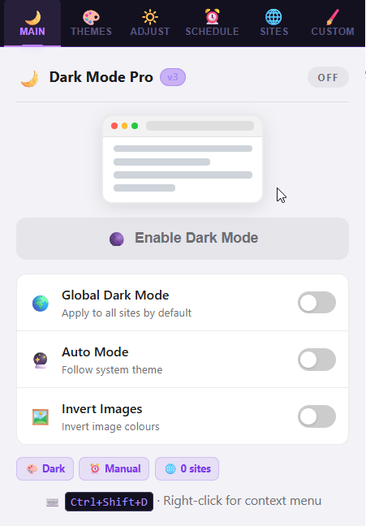
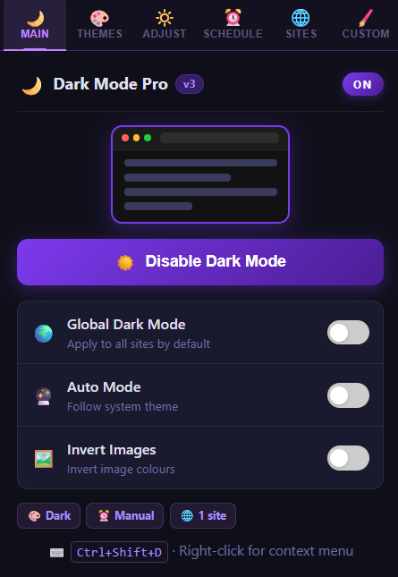
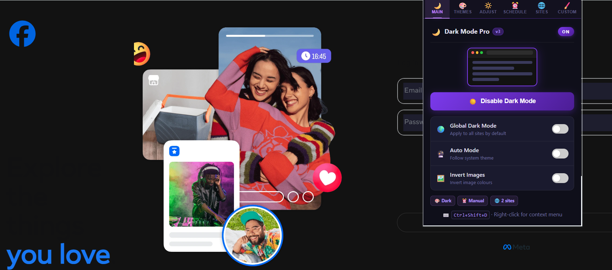
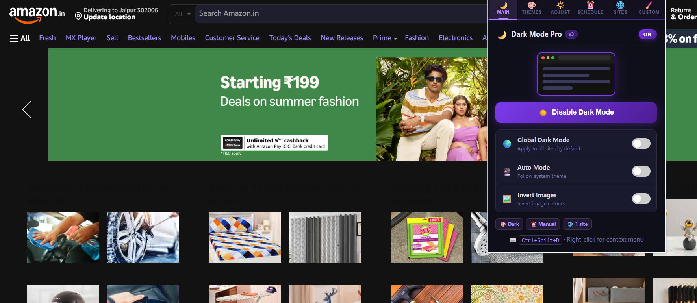
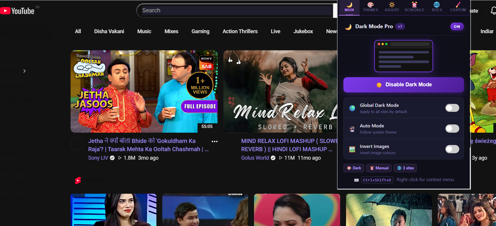

<h1 align="center">🌙 Dark Mode Pro</h1>

  <b>Beautiful • Fast • Lightweight • Eye-Friendly</b>

  Experience the web in true dark mode with smooth performance and full customization control.

  <a href="https://kk-092.github.io/Dark-Mode-Pro/">
    🌐 Live Website
  </a>

---

  
  
  
  

---

## 🚀 About Dark Mode Pro

Dark Mode Pro transforms any website into a **smooth, eye-friendly dark theme**, improving readability and reducing eye strain during long browsing sessions.

It is built for **speed, simplicity, and full control** over your browsing experience.

---

## ✨ Key Features

* 🌙 Enable dark mode on all websites instantly
* 🎯 Per-site control (ON/OFF for each website)
* 🎨 Adjustable brightness & contrast
* 🖼 Smart image handling (no broken visuals)
* ⏰ Schedule automatic dark mode (night mode)
* ⚡ Ultra-lightweight & fast performance
* 🧩 Clean, modern UI design

---

## 🎬 Demo

  
   

👉 Replace this with your real `demo.gif` for best impact

---

## 🎯 Why Dark Mode Pro?

* 🌙 Protect your eyes during night browsing
* 📖 Improve focus & readability
* ⚡ Faster and distraction-free browsing
* 🎨 Fully customizable experience

---

## ⚡ Advanced Controls

* 🌗 Multiple themes (Dark, Midnight, Sepia, etc.)
* 🔧 Fine-tune brightness & contrast
* 🚫 Website whitelist/blacklist support
* 👀 Real-time preview changes

---

## 🔒 Privacy First

We take privacy seriously:

* ❌ No tracking
* ❌ No data collection
* ❌ No external servers
* ✅ Everything stored locally

---

## 🛠 Permissions

We only request necessary permissions to apply dark mode on websites.

👉 We DO NOT read, store, or share your data.

---

## 📦 Installation

1. Download or install from Chrome Web Store or from official website
2. Pin the extension in Chrome
3. Click and enable Dark Mode Pro
4. Enjoy better browsing 😎

---

## 📸 Preview

  

  

  

---

## 🚀 Get Started

  <a href="https://kk-092.github.io/Dark-Mode-Pro/">
    👉 Visit Official Website
  </a>

---

  Made with ❤️ for better and safer browsing experience

